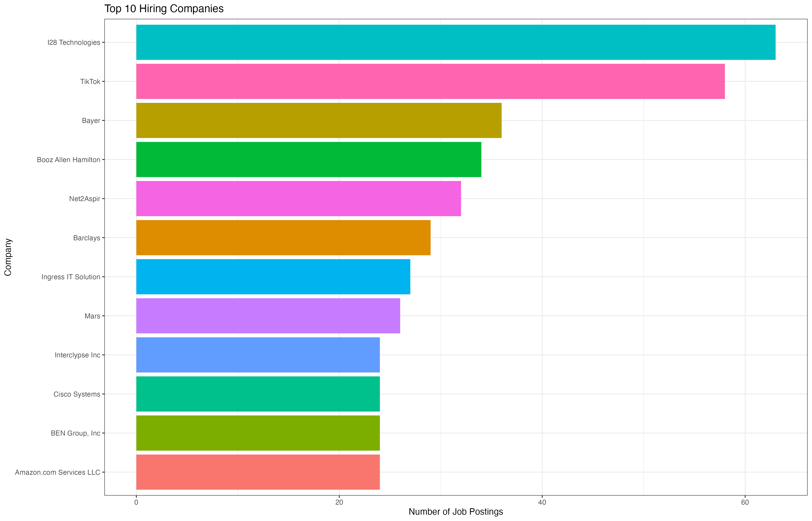
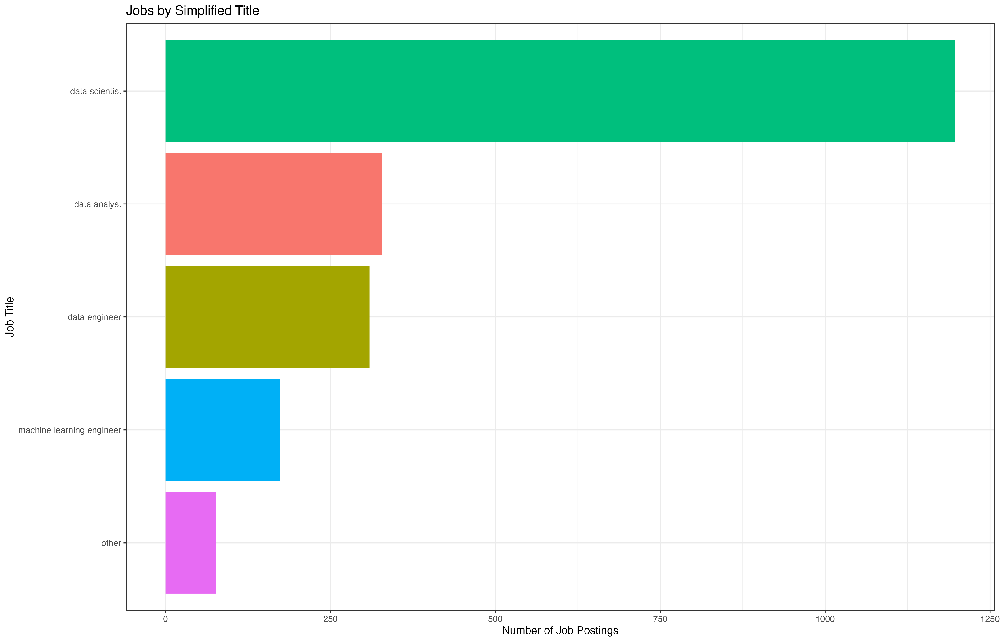
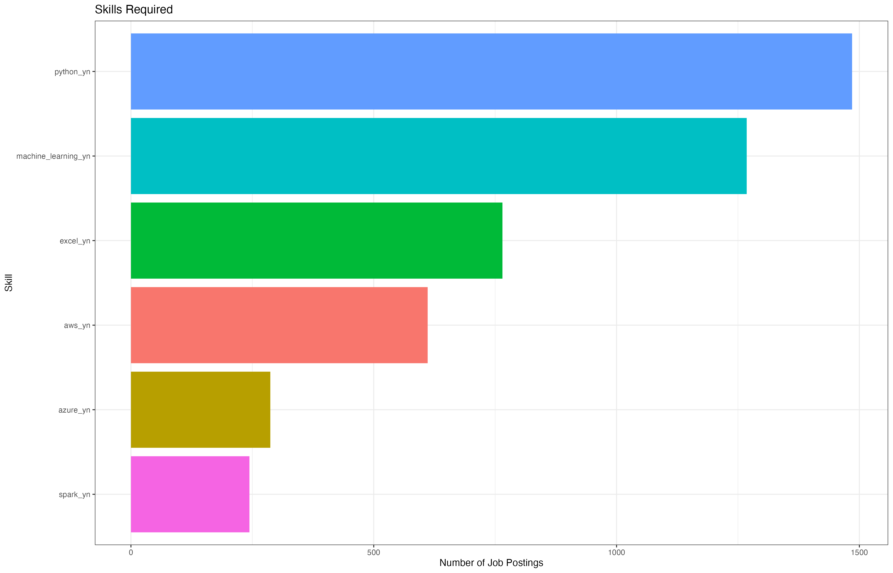
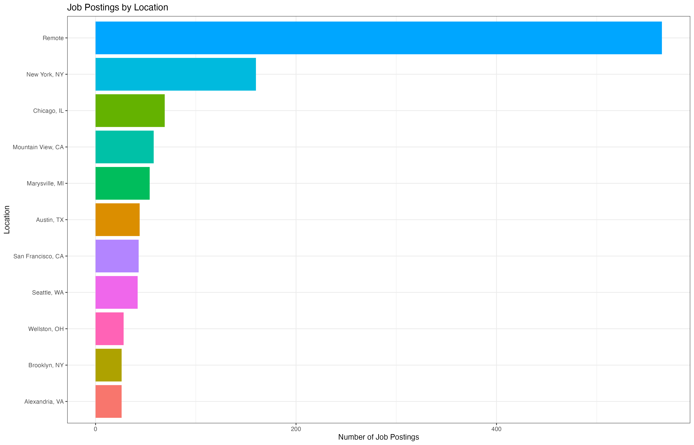
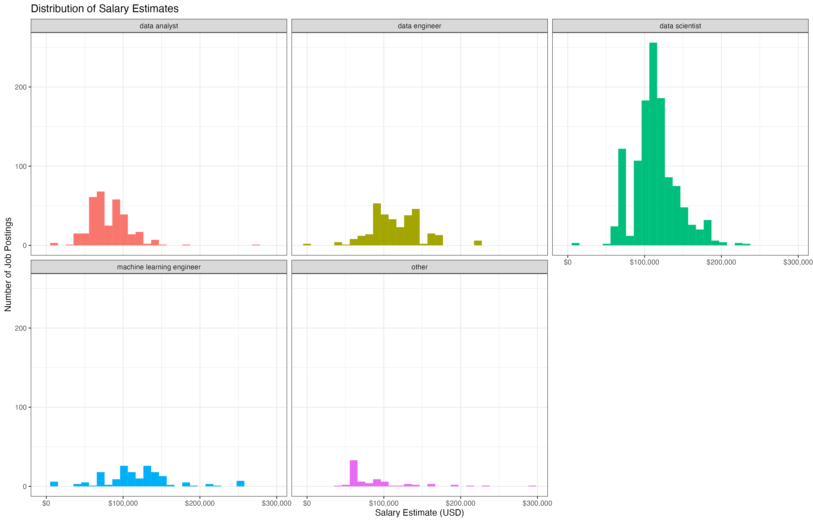
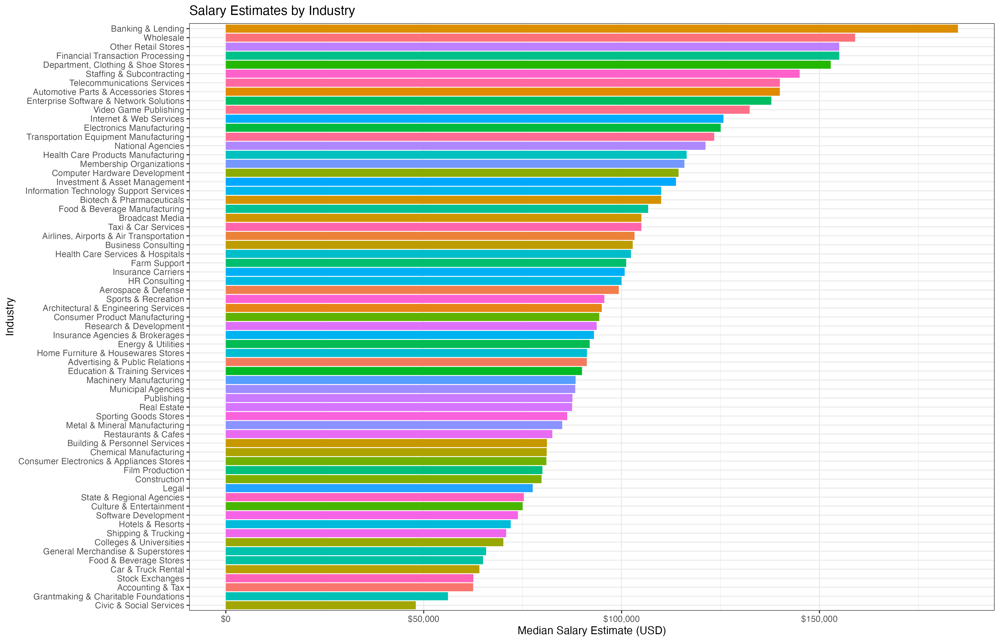
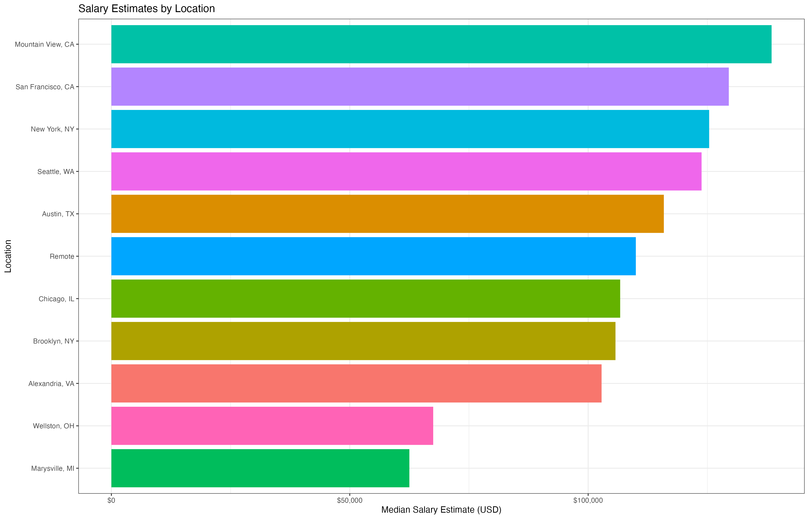

# Visualization-in-R-Practice-1
This was my final submission to a test administered in my Data Science class. I was tasked with exploring a dataset summarizing job postings from various companies around the US. All of the job postings have something to do with data, and most of them are data science jobs. I completed this individually and without the use of any AI tools.

### 1. top_hiring_companies - plot_1

Create plot_1 to display the top 10 companies in the dataset in terms of the number of job postings listed. (Note that there are 4 ties for the 9th spot, so the tibble and the subsequent plot show 12 companies.) 



---

### 2. top_job_titles - plot_2

Create a plot to display a count of each of the simplified job titles in the dataset.



---

### 3. skill_counts - plot_3

Create a plot to display the sum of each of the skills summary tibble that sums each of the `_yn` skills columns. Each of those columns is a binary indicator of whether a given job description mentioned python, spark, etc. 

Save that summarized view of the data to a new tibble called `skill_counts` with two columns (`skill` and `count`), then use it to create a plot that matches the one below. Save this plot as `plot_3`.



> [!IMPORTANT] 
> You should now have both `skill_counts` and `plot_3` in your environment.

---

### 4. top_10_job_locations, plot_4

Next, you'll need to create a summary tibble that shows the top 10 locations in the dataset in terms of the number of job postings associated with that location. (Note that there is a tie for the 10th spot, so there will be 11 total locations.)

Save that summarized view of the data to a new tibble called `top_10_job_locations` with 2 columns (`location` and `n`), then use it to create a plot that matches the one below. Save this plot as `plot_4`.



> [!IMPORTANT] 
> You should now have both `top_10_job_locations` and `plot_4` in your environment.

---

### 5. plot_5

Next, you'll need to create a plot (with no associated summary dataset because it can be derived directly from the `job_data` tibble) that summarizes the distribution of salaries by (simplified) job title, similar to the one found below. Save this plot as `plot_5`.



> [!IMPORTANT] 
> You should now have `plot_5` in your environment.

---

### 6. industry_salary, plot_6

Next, you'll need to create a summary tibble that shows the mean and median salaries by industry. (You can filter out any `NA`s in the `company_industry` column.)

Save that summarized view of the data to a new tibble called `industry_salary` with 3 columns (`company_industry`, `median_salary`, and `mean_salary`), then use it to create a plot that matches the one below. Save this plot as `plot_6`. (Note that the tibble doesn't necessarily need to be ordered by either of the salary columns, but the bars on the plot do.)



> [!IMPORTANT] 
> You should now have both `industry_salary` and `plot_6` in your environment.

---

### 7. top_locations_salary, plot_7

Next, you'll need to create a summary tibble that shows the mean and median salaries by location, but only for the top 10 locations (in terms of number of postings, not in terms of salaries, which means there will again be 11 locations in your results because of the tie for 10th place). The result should look like the preview below:

```r
# A tibble: 11 × 3
   location          median_salary mean_salary
   <chr>                     <dbl>       <dbl>
 1 Alexandria, VA           102817     109075.
 2 Austin, TX               115874     103778.
```

Save that summarized view of the data to a new tibble called `top_locations_salary`, then use it to create a plot that matches the one below. Save this plot as `plot_7`. (Note that the tibble doesn't necessarily need to be ordered by either of the salary columns, but the bars on the plot do.) 



> [!IMPORTANT] 
> You should now have both `top_locations_salary` and `plot_7` in your environment.

---

# Final Cleanup and Submission

Please do the following to make sure your code runs without errors and passes the submission checks:

1. Run the "Pre-Submission Checks" section to check whether you saved (and spelled) all of the expected variables and columns along the way. Take care of any issues it uncovers.
2. Restart your R session (Session >> Restart R).
3. Run your entire script from the beginning, watching for any errors along the way. Easiest way to do this is to "Select All" and then hit "Run". If you have any errors (including in the Pre-Submission Checks section), you'll want to fix them before submitting.
